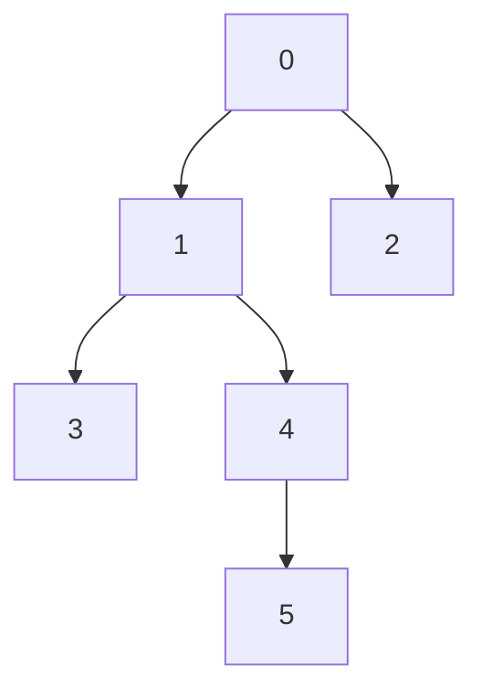

# RRT Algorithm

Implementation of RRT algorithm based on Algobotics youtube vidoes:

https://www.youtube.com/watch?v=TzfNzqjJ2VQ

## Dependancies
- pygame

## Algorithm details

### Definition of the graph

## Results

